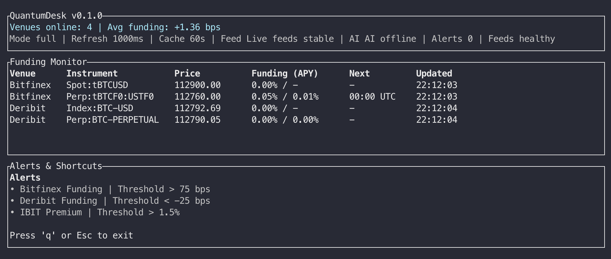
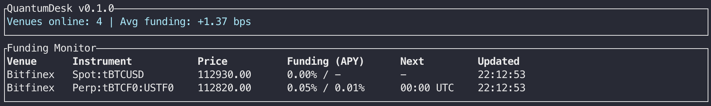

# QuantumDesk 🚀

> The world's most intelligent open-source financial terminal - democratizing AI-powered trading insights for everyone

[](https://www.rust-lang.org/)
[](https://opensource.org/licenses/MIT)
[](http://makeapullrequest.com)

## Vision

QuantumDesk revolutionizes financial analysis by combining real-time market data, AI-powered insights, and a beautiful terminal interface. Whether you're tracking crypto perpetuals, traditional futures, or ETF premiums, QuantumDesk provides the intelligence layer that transforms raw market data into actionable insights—with an MCP-driven agent backbone and a Telescope-style command palette for instant context switching across markets, alerts, and AI playbooks.

## Status

QuantumDesk is in **pre-alpha**. The current build renders a responsive Ratatui dashboard with live Bitfinex and Deribit funding snapshots, minute-level HTTP caching, alert scaffolding, and module placeholders for AI, metrics, and configuration. Tune update cadence via `--refresh-ms`, control cache TTL via `--cache-ttl`, and toggle a condensed interface with `--compact`. Follow the milestone breakdown in [ROADMAP.md](ROADMAP.md) as we march toward broader exchange connectivity.

## Demo

### Full Desk


### Compact Desk


## Core Features

### 🔄 Multi-Exchange Integration
- **Crypto**: Bitfinex, Deribit, Binance, OKX, Bybit
- **Traditional**: Interactive Brokers, TD Ameritrade (planned)
- **ETFs**: Real-time NAV tracking with BTC normalization

### 🧠 AI-Powered Analysis
- **Claude/GPT Integration**: Natural language market analysis
- **MCP Protocol**: Extensible AI agent ecosystem
- **Predictive Models**: Funding rate forecasting, volatility analysis
- **Risk Assessment**: Real-time position sizing recommendations

### 📊 Advanced Metrics
- **Funding Rates**: Current, predicted, historical trends
- **Basis Trading**: Spot vs futures spreads across venues
- **ETF Premiums**: IBIT, FBTC normalized to underlying BTC
- **Volatility Surface**: Options-derived market sentiment

### 🎯 Intelligent Alerts
- **Threshold Monitoring**: Customizable price/funding alerts
- **AI Reasoning**: Context-aware alert explanations
- **Terminal Notifications**: Native OS integration
- **Strategy Signals**: Automated opportunity detection

### 🖥️ Beautiful TUI
- **Responsive Design**: Auto-adapting layouts for any screen size
- **Real-time Charts**: Funding curves, price movements, correlations
- **Customizable Dashboards**: User-defined panel arrangements
- **Command Palette**: Telescope-inspired fuzzy launcher for panes, feeds, and AI actions (planned)
- **Dark/Light Themes**: Eye-friendly for extended use

## Quick Start

```bash
# Clone and run
git clone https://github.com/yourusername/quantumdesk
cd quantumdesk
cargo run

# Or install globally
cargo install quantumdesk
quantumdesk

# Custom refresh / cache settings
cargo run -- --refresh-ms 2000 --cache-ttl 90

# Compact layout
cargo run -- --compact
```

Press `q` or `Esc` inside the terminal UI to exit the demo.

## Architecture

QuantumDesk follows a modular, async-first architecture:

```
┌─────────────────┐    ┌─────────────────┐    ┌─────────────────┐
│   Data Layer    │    │  Metrics Layer  │    │    UI Layer     │
├─────────────────┤    ├─────────────────┤    ├─────────────────┤
│ • Exchange APIs │───▶│ • Normalization │───▶│ • TUI Renderer  │
│ • WebSocket     │    │ • Calculations  │    │ • Event Handler │
│ • Rate Limiting │    │ • Predictions   │    │ • Layout Engine │
└─────────────────┘    └─────────────────┘    └─────────────────┘
         │                       │                       │
         ▼                       ▼                       ▼
┌─────────────────┐    ┌─────────────────┐    ┌─────────────────┐
│  AI Integration │    │ Alert Manager   │    │ Config Manager  │
├─────────────────┤    ├─────────────────┤    ├─────────────────┤
│ • MCP Protocol  │    │ • Thresholds    │    │ • User Settings │
│ • LLM Clients   │    │ • Notifications │    │ • API Keys      │
│ • Reasoning     │    │ • History       │    │ • Preferences   │
└─────────────────┘    └─────────────────┘    └─────────────────┘
```

### Module Layout

- `app/` – central state machine that orchestrates data, metrics, alerts, and AI modules.
- `ui/` – Ratatui renderer with responsive panels and keyboard handling.
- `data/` – exchange connectors (REST/WebSocket) and shared market schema definitions.
- `metrics/` – normalization, funding/basis calculations, and derived analytics.
- `alerts/` – threshold tracking, escalation hooks, and notification adapters.
- `ai/` – MCP-driven agent integrations and reasoning pipelines.
- `config/` – user settings, API key management, and environment overrides.

## Roadmap

Detailed milestone tracking lives in [ROADMAP.md](ROADMAP.md).

### Phase 1: Foundation (Months 1-2)
- [ ] Core TUI framework with ratatui
- [ ] Bitfinex & Deribit API clients
- [ ] Basic funding rate monitoring
- [ ] Simple alert system
- [ ] Configuration management
- [ ] Telescope-style command palette for panes, symbols, and commands

### Phase 2: Intelligence (Months 2-3)
- [ ] Claude/OpenAI integration
- [ ] MCP protocol implementation with pluggable analysts
- [ ] Predictive funding models
- [ ] Advanced charting capabilities
- [ ] Historical data storage

### Phase 3: Expansion (Months 3-4)
- [ ] Additional exchange support
- [ ] ETF tracking (IBIT, FBTC, etc.)
- [ ] Economic calendar integration
- [ ] Strategy backtesting framework
- [ ] Plugin ecosystem launch

### Phase 4: Community (Months 4-6)
- [ ] Web interface companion
- [ ] Mobile notifications
- [ ] Community strategy sharing
- [ ] Paper trading mode
- [ ] Advanced risk management

## Contributing

We welcome contributions from traders, developers, and financial enthusiasts!

### Getting Started
1. Check our [Contributing Guide](CONTRIBUTING.md)
2. Browse [Good First Issues](https://github.com/yourusername/quantumdesk/labels/good%20first%20issue)
3. Join our [Discord Community](https://discord.gg/quantumdesk)

### Development Setup
```bash
# Install Rust toolchain
curl --proto '=https' --tlsv1.2 -sSf https://sh.rustup.rs | sh

# Clone and setup
git clone https://github.com/yourusername/quantumdesk
cd quantumdesk
cargo build
cargo test
```

### Areas We Need Help
- **Exchange Integrations**: New venue support
- **AI Agents**: Custom MCP implementations
- **UI/UX**: Theme design, layout improvements
- **Documentation**: Tutorials, API docs
- **Testing**: Integration tests, fuzzing

## Community

- **GitHub Discussions**: Technical questions & feature requests
- **Discord**: Real-time community chat
- **Twitter**: [@QuantumDeskApp](https://twitter.com/quantumdeskapp)
- **Reddit**: [r/QuantumDesk](https://reddit.com/r/quantumdesk)

## License

MIT License - see [LICENSE](LICENSE) for details.

## Disclaimer

QuantumDesk is for educational and informational purposes. Always conduct your own research and consider your risk tolerance before making financial decisions.

---

**Built with ❤️ by the open-source community**

*"Democratizing intelligent trading, one terminal at a time"*
